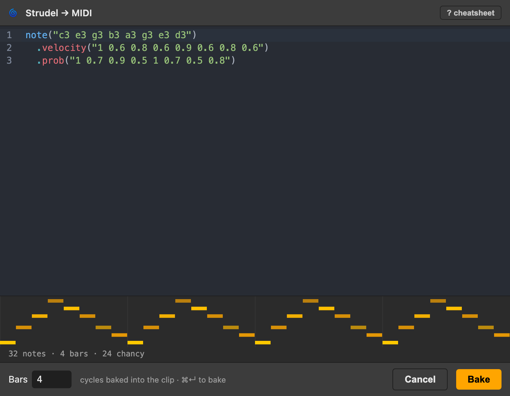

# strudelton

Author [Strudel](https://strudel.cc) patterns and bake them into Ableton Live MIDI clips — as a
Live **Extension** (Extensions SDK, Live 12.4.5+ Suite beta). A built-in CodeMirror editor with a
live piano-roll preview turns a Strudel pattern into notes in a clip: melodies, drums, scales,
velocity, and per-note probability that re-rolls every loop.

> **Status:** a working probe (see [`PROPOSAL.md`](PROPOSAL.md) for the original brief and
> [`FINDINGS.md`](FINDINGS.md) for what it taught us). Bakes in Live 12.4.5 beta; rearchitected to
> run sandbox-native (no temp files / no child process) so it targets the **installed/managed** host,
> not just Developer Mode.



## What it does

- **Right-click a Session clip slot → "Strudel: Edit & bake…"** — opens the editor; write a pattern,
  set how many **bars** to bake, hit **Bake**. The pattern's notes land in a fresh looping MIDI clip.
- **Right-click a MIDI clip → "Strudel: Edit & bake…"** — re-open that clip's pattern and re-bake.
- **Live preview** in the editor: a piano-roll of exactly what will bake, transpile errors inline,
  and a flag for sound-only controls that get dropped (`speed`, `lpf`, …).
- **Built-in cheat sheet** (the **? cheatsheet** button): what bakes — scales, chords, arps,
  velocity/probability, drums — plus the Strudel-vs-Ableton octave gotcha and what's ignored.

### Supported in patterns
- Full Strudel core + mini-notation, **scales/keys/chords** (`@strudel/tonal`), **drums**
  (`s("bd sd hh")` → Drum Rack), **velocity** (`.velocity()`/`.gain()`), and **probability**
  (`.prob()`/`.chance()` → Live re-rolls each loop).
- **Chords** as stacks (`note("c,e,g")`) or voiced symbols (`chord("Cm7").voicing()`); **arps** via
  numeric indices on a voiced chord (`chord("C").voicing().arp("0 1 2 1")`).
- **Octaves:** Strudel uses scientific pitch — `c4` = Ableton's “C3” (Strudel labels run one octave
  higher). Shift with `.add(note(12))`; `.octave()` is ignored.
- Sound-engine controls (`.lpf()`, `.room()`, `.speed()`, …) evaluate but are **dropped** — this
  bakes notes, not sound (do sound design on the Ableton track). The editor flags them.
- Not possible via the SDK: MPE / per-note pitch-bend / continuous automation (no such API).

## Architecture (in one breath)

The Extension Host runs a bare, shared-scope V8 that breaks Strudel in-process, and the *installed*
Host sandboxes Node (no temp files, no child process). So Strudel runs entirely in the modal webview
— which already drew the live preview, and now bakes too:

```
Extension Host ──showModalDialog("data:…<editor.html>")──▶ webview: editor.html (CodeMirror+Strudel)
  (extension.js, ~17 kb,                                     evaluates · previews · BAKES
   no Strudel / no fs / no spawn)  ◀──close_and_send({code,bars,notes})──┘
        └─ writes notes to the clip via the SDK (createMidiClip + clip.notes = notes)
```

The extension is a thin client that only makes SDK calls; all Strudel lives in the webview. See
[`FINDINGS.md`](FINDINGS.md) for the full story (and the dead ends — including the child process that
worked in Developer Mode but not when installed).

## Build & run

Requires **Node 24** (pinned via [`mise.toml`](mise.toml)) and **Ableton Live 12.4.5+ Suite beta**.

```bash
mise install                       # Node 24.16.0
# Obtain the Extensions SDK first — see "The SDK is not included" below.
cd extension
npm install                        # resolves the SDK + CLI from vendor/sdk/*.tgz
cp .env.example .env               # set EXTENSION_HOST_PATH to your Live beta .app
# In Live: Preferences → Extensions → enable Developer Mode, then:
npm start                          # builds + loads the extension into the running Live
```

Then use the context-menu actions above. More detail in [`extension/README.md`](extension/README.md).

To make an installable archive (Developer Mode off): `cd extension && npm run package` →
`strudelton-<version>.ablx`. Pre-built `.ablx` files are attached to the [Releases](../../releases).

## The SDK is not included

The **Ableton Extensions SDK is confidential pre-release material** and its license forbids
redistributing it. So this repo does **not** contain it — `vendor/` is gitignored. To build,
obtain the SDK zip from Ableton (Centercode beta) and extract it so these exist:

```
vendor/sdk/ableton-extensions-sdk-1.0.0-beta.0.tgz
vendor/sdk/ableton-extensions-cli-1.0.0-beta.0.tgz
```

`extension/package.json` resolves the SDK + CLI from those paths. (The packaged `.ablx` bundles the
SDK's runtime wrapper *inside your application*, which the SDK license explicitly permits.)

## License

**AGPL-3.0** (see [`LICENSE`](LICENSE)) — required because the bake engine is
[Strudel](https://strudel.cc), which is AGPL-3.0. All of this project's own source is here.

Dependency licenses:
- `@strudel/*` — **AGPL-3.0** (bundled into `dist/editor.html` only — the webview).
- `@ableton-extensions/sdk` — **proprietary** (Ableton; not included; bundled into `dist/extension.js` only).
- CodeMirror, `@tonaljs/tonal`, etc. — permissive (MIT-ish).

Strudel (AGPL) and the Ableton SDK (proprietary) are bundled into **separate files** — `editor.html`
and `extension.js` — that only communicate across the webview boundary (a data: URL out, a JSON
string back); they are never linked into one binary. The extension reads `editor.html` at runtime
rather than `import`-inlining it, precisely to keep that split.
